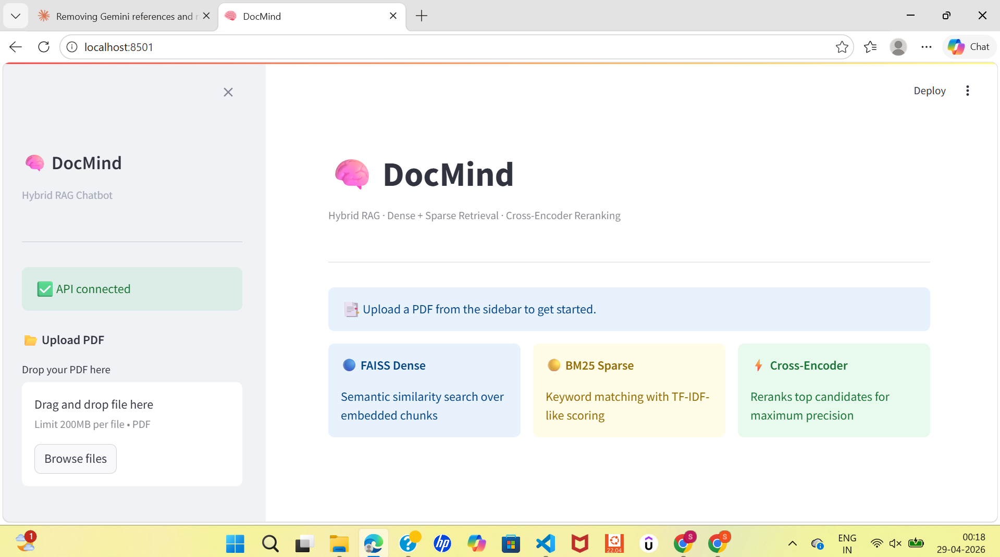
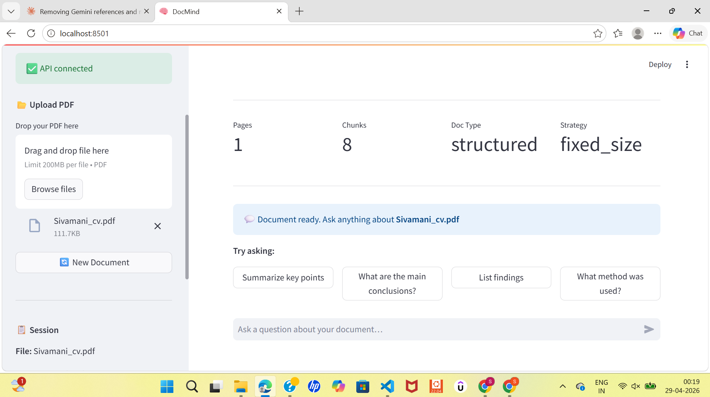
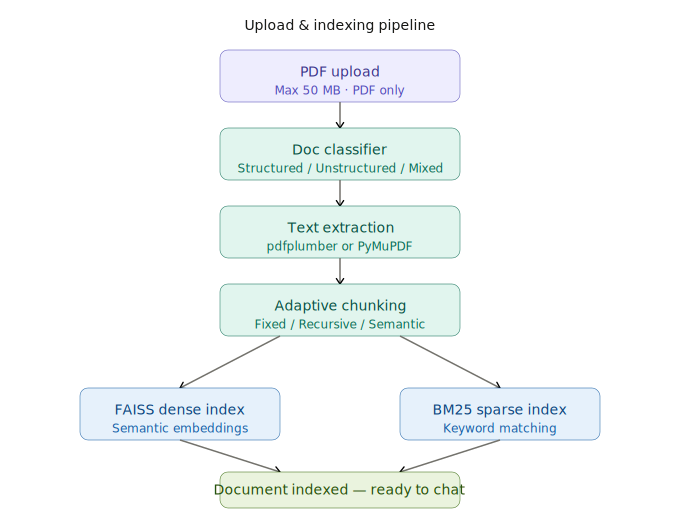
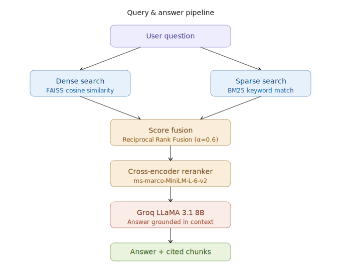

# 🧠 DocMind — Hybrid RAG Document Chatbot

> Upload any PDF and chat with it using state-of-the-art retrieval techniques powered by Groq LLaMA.


---

## 📸 App Preview

### Home Screen


### Chat in Action


---

## ✨ Features

- 📄 **PDF Upload** — Upload any PDF up to 50MB
- 🔍 **Hybrid Retrieval** — FAISS dense search + BM25 sparse search combined via Reciprocal Rank Fusion
- ⚡ **Cross-Encoder Reranking** — ms-marco-MiniLM for maximum precision
- 🤖 **Groq LLaMA 3.1** — Fast, accurate answers grounded strictly in your document
- 🧠 **Smart Chunking** — Auto-classifies PDF as structured / unstructured / mixed and chunks accordingly
- 💬 **Chat History** — Multi-turn conversation with memory (last 6 turns)
- 📎 **Source Citations** — Every answer shows which chunks and pages were used

---

## 🏗️ Architecture

### System Overview


### Upload & Indexing Pipeline


### Query & Answer Pipeline


---

## 🚀 Quick Start (Local)

### 1. Clone the repo
```bash
git clone https://github.com/sivamani-muraboyina/DOCMIND.git
cd DOCMIND
```

### 2. Create virtual environment
```bash
python -m venv .venv

# Windows
.venv\Scripts\activate

# Mac/Linux
source .venv/bin/activate
```

### 3. Install dependencies
```bash
pip install -r requirements.txt
```

### 4. Set up environment variables
```bash
# Windows
copy .env.example .env

# Mac/Linux
cp .env.example .env
```

Open `.env` and add your Groq API key — get one free at [console.groq.com](https://console.groq.com):
```
GROQ_API_KEY=your_groq_api_key_here
```

### 5. Run Backend (Terminal 1)
```bash
uvicorn backend.main:app --host 0.0.0.0 --port 8000 --reload
```

### 6. Run Frontend (Terminal 2)
```bash
streamlit run frontend/app.py
```

### 7. Open in browser
```
http://localhost:8501
```

---

## 🐳 Run with Docker

```bash
copy .env.example .env   # fill in your GROQ_API_KEY
docker-compose up --build
```

| Service | URL |
|---|---|
| Frontend (Streamlit) | http://localhost:8501 |
| Backend (FastAPI) | http://localhost:8000 |
| API Docs (Swagger) | http://localhost:8000/docs |

---

## 📁 Project Structure

```
DOCMIND/
├── backend/
│   ├── models/
│   │   └── schemas.py              # Pydantic request/response models
│   ├── routers/
│   │   ├── chat.py                 # POST /ask endpoint
│   │   └── upload.py               # POST /upload endpoint
│   ├── services/
│   │   ├── llm_chain.py            # Groq LLaMA via LangChain
│   │   ├── embeddings.py           # Sentence-transformers
│   │   ├── vector_store.py         # FAISS in-memory index
│   │   ├── bm25_store.py           # BM25 in-memory index
│   │   ├── retriever.py            # Hybrid retrieval + reranking
│   │   └── pdf_processor.py        # PDF text extraction
│   └── utils/
│       ├── chunker.py              # Adaptive chunking
│       └── doc_classifier.py       # PDF type classification
├── frontend/
│   └── app.py                      # Streamlit UI
├── docs/                           # ← put your diagrams + screenshots here
│   ├── architecture.svg
│   ├── upload_flow.svg
│   ├── query_flow.svg
│   ├── screenshot_home.png
│   └── screenshot_chat.png
├── hf_app.py                       # Hugging Face Spaces entry point
├── requirements.txt
├── Dockerfile
├── docker-compose.yml
└── .env.example
```

---

## ⚙️ Environment Variables

| Variable | Default | Description |
|---|---|---|
| `GROQ_API_KEY` | — | **Required.** Get free at [console.groq.com](https://console.groq.com) |
| `UPLOAD_DIR` | `./uploads` | Where uploaded PDFs are saved |
| `MAX_FILE_SIZE_MB` | `50` | Max upload size in MB |
| `TOP_K_DENSE` | `10` | FAISS top-k results |
| `TOP_K_SPARSE` | `10` | BM25 top-k results |
| `TOP_K_RERANK` | `5` | Final chunks after reranking |
| `HYBRID_ALPHA` | `0.6` | Dense vs sparse weight (1.0 = all dense) |
| `GROQ_TEMPERATURE` | `0.2` | LLM temperature |
| `GROQ_MAX_OUTPUT_TOKENS` | `2048` | Max response tokens |
| `CHUNK_SIZE_DEFAULT` | `512` | Default chunk size |
| `CHUNK_SIZE_STRUCTURED` | `256` | Chunk size for structured PDFs |

---

## 📡 API Endpoints

| Method | Endpoint | Description |
|---|---|---|
| `POST` | `/upload/` | Upload and index a PDF — returns `session_id` |
| `POST` | `/ask/` | Ask a question using `session_id` |
| `GET` | `/health` | API status + active session count |
| `GET` | `/docs` | Swagger UI |

---

## 🛠️ Tech Stack

| Layer | Technology |
|---|---|
| **LLM** | Groq — LLaMA 3.1 8B Instant |
| **Embeddings** | sentence-transformers all-MiniLM-L6-v2 |
| **Dense Search** | FAISS IndexFlatIP |
| **Sparse Search** | BM25 Okapi |
| **Reranker** | cross-encoder ms-marco-MiniLM-L-6-v2 |
| **PDF Extraction** | pdfplumber + PyMuPDF |
| **Backend** | FastAPI + Uvicorn |
| **Frontend** | Streamlit |
| **Orchestration** | LangChain |

---

## 🙏 Acknowledgements

- [Groq](https://groq.com) for blazing fast LLM inference
- [LangChain](https://langchain.com) for LLM orchestration
- [Hugging Face](https://huggingface.co) for embedding and reranker models
- [Streamlit](https://streamlit.io) for the UI framework
- [FAISS](https://github.com/facebookresearch/faiss) by Meta AI for vector search
